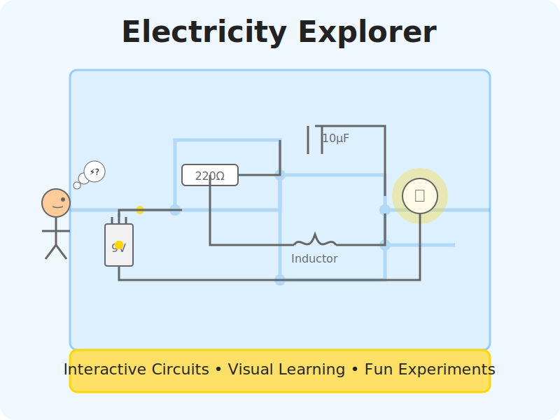

# Electricity Explorer

An interactive web application to teach children the basics of electronics in a fun, visual way.

## 🔌 Overview

Electricity Explorer is designed to help kids understand fundamental electricity concepts through hands-on, interactive demonstrations. Each section features animated visualizations and playful interfaces that make abstract concepts tangible and engaging.

Perfect for curious 10-year-olds (and their parents!) who want to learn how electricity works without the complexity of traditional textbooks.

## ⚡ Features

- **Interactive Demonstrations** - Watch electrons flow, see capacitors charge/discharge, and observe how resistors affect current
- **Visual Learning** - Colorful animations bring abstract concepts to life
- **Hands-On Circuits** - Adjust voltage, resistance, and other values to see immediate effects
- **Kid-Friendly Explanations** - Complex ideas explained in simple, approachable language
- **Fun Quizzes** - Test knowledge with interactive challenges

## 📚 Chapters

- **Introduction to Electricity** - Understand electrons, voltage, current, and resistance
- **Resistors** - Learn about resistance, color codes, and circuit configurations
- **Capacitors** - Explore energy storage, charging/discharging, and capacitor types
- **Inductors** - Discover magnetic fields, inductance, and coil properties
- **Circuits** - Combine components into functional circuits

## 🚀 Getting Started

1. Clone this repository
2. Open `index.html` in any modern web browser
3. Navigate through chapters using the main menu

No build process or special software required!

## 🔧 Technologies

- HTML5
- CSS3
- Vanilla JavaScript (no frameworks)

## 📖 Educational Approach

This project uses visual metaphors, simplified models, and interactive elements to make electronics concepts accessible to young learners. Complex ideas are broken down into manageable, engaging chunks that build on each other.

Interactive elements are designed to encourage experimentation and discovery, letting kids learn by doing rather than just reading.

## 📝 License

This project is licensed under the GNU General Public License v3.0 - see the LICENSE file for details.

## 💡 Inspiration

Inspired by [Bartosz Ciechanowski's amazing work](https://ciechanow.ski/), which demonstrates complex technical concepts through interactive visualizations.

## 🙏 Acknowledgments

- SVG illustrations and animations adapted from various open educational resources
- Special thanks to my 10-year-old son, whose curiosity inspired this project